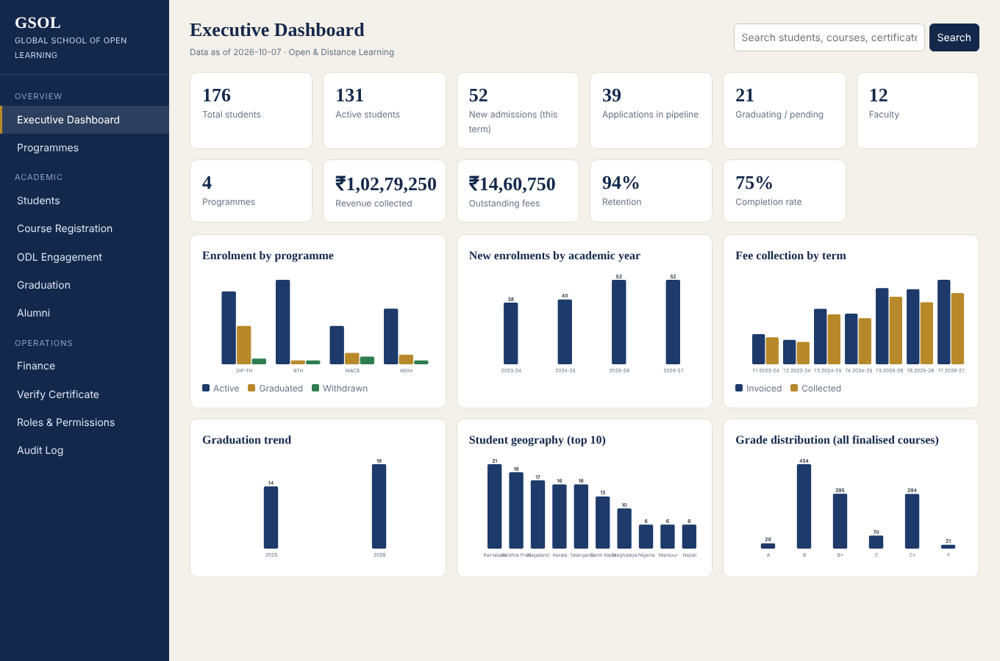

# GSOL ERP — Global School of Open Learning

A working database + demo for an integrated ERP / Student Information System for the Global School of Open Learning (GSOL), an Open and Distance Learning theological institution.

## Programmes

- Diploma in Theology
- Bachelor of Theology
- Master of Arts in Christian Studies
- Master of Divinity

## Core Modules

- Admissions
- Student Management
- Programmes & Curriculum
- Course Registration
- ODL / LMS Integration
- Faculty Management
- Assessments & Assignments
- Examinations & Results
- Academic Progress
- Fees & Payments
- Scholarships
- Library
- Research / Dissertation
- Ministry Internship / Practicum
- Communication
- Document Management
- Certificates & Transcripts
- Graduation
- Alumni
- Reports & Analytics
- Role-Based Access Control
- Audit & Security



## Quick start (demo)

Requires PostgreSQL 14+ and Node 20+.

```bash
export PGHOST=localhost PGUSER=postgres      # your server
tools/demo.sh                                # builds DB "gsol" (schema + demo data) and serves http://localhost:3000
```

## What is in the repo

| Path | Purpose |
|---|---|
| `database/schema.sql` | 83 tables, 6 views, lifecycle functions & triggers (prerequisites, grading, graduation, audit) |
| `database/seed/01–07_*.sql` | Realistic synthetic data: 4 programmes, 25 courses, 176 students, 530 invoices, 2,500 exam results, 33 graduates |
| `app/` | Read-only REST API + responsive dashboard (Node + `pg`, no framework) |
| `docs/ARCHITECTURE.md` | Architecture, module map, lifecycle, RBAC, roadmap |
| `tools/rebuild.sh` | Drop/recreate the database from the SQL files |

## Try these in the demo
- **Students → GSOL-2023-0001**: 100% of credits earned, yet graduation is blocked by outstanding fees — computed in SQL.
- **Course Registration**: ask for `EX501` / `DIS599` for a first-term student → blocked by prerequisites.
- **Verify Certificate**: `GSOL-2025-C0001` (public verification).
- **ODL Engagement**: red/yellow enrolments from Moodle activity and gradebook.

## Stack
PostgreSQL (system of record) · REST API (Node today; NestJS/Django later) · Moodle integration tables · Next.js front end planned.
All demo data is synthetic (example.org addresses).
